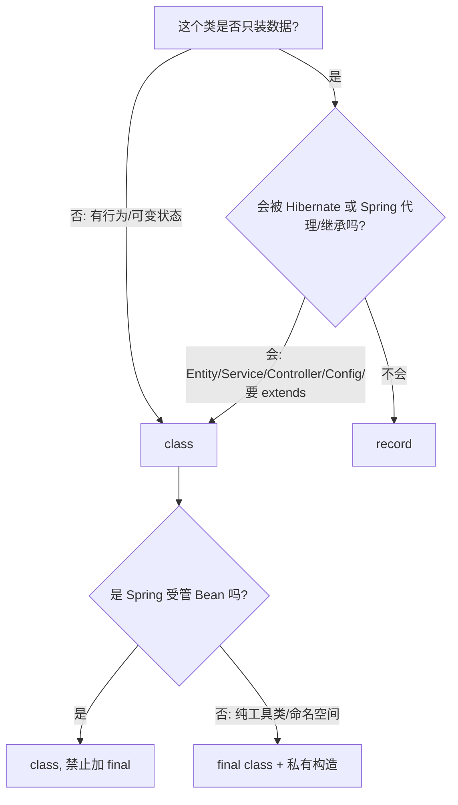

# 海峡金 OA 审批系统开发规范

> 本文件为开发者和 AI Coding Agent 提供项目特定的开发指导和规范。
> 在进行任何开发工作前，请仔细阅读并遵守本规范。

---

## 1. 项目概述

**海峡金 OA 审批系统** 是一个基于 Spring Boot 的企业级审批工作流系统，支持单据提交、多级审批、归档台账、统计看板等功能。

### 技术栈
- **Java 17**
- **Spring Boot 3.2.5**（Web / Data JPA / Security / AOP / Validation）
- **Spring Security + JWT**（无状态认证）
- **Flowable 7.0**（工作流引擎）
- **MySQL 8**（生产数据库）
- **Flyway**（数据库版本管理）
- **Redis**（幂等性缓存、未来 Token 管理）
- **SpringDoc OpenAPI**（API 文档）
- **EasyExcel**（台账导出）
- **H2**（测试数据库）

---

## 2. 项目结构

```
src/main/java/com/hxj/
├── OaApplication.java              # 启动类
├── approval/                       # 审批操作模块
│   ├── ApprovalActionController.java
│   ├── ApprovalActionService.java
│   ├── ApprovalRequest.java        # 审批请求 DTO
│   ├── ApprovalResultResponse.java # 审批结果 DTO
│   ├── SignRequest.java            # 加签请求 DTO
│   ├── VoidDocumentRequest.java    # 作废单据请求 DTO
│   └── ApprovalHistoryItemResponse.java # 审批历史项 DTO
├── archive/                        # 归档台账模块
│   ├── ArchiveLedgerController.java
│   ├── ArchiveLedgerService.java
│   ├── ArchiveLedgerPageRequest.java   # 归档分页查询请求 DTO
│   ├── ArchiveLedgerQueryRequest.java  # 归档查询条件 DTO
│   └── ArchiveLedgerItemResponse.java  # 归档条目 DTO
├── auth/                           # 认证模块
│   ├── AuthController.java
│   ├── AuthService.java
│   ├── LoginRequest.java           # 登录请求 DTO
│   ├── LoginResponse.java          # 登录响应 DTO
│   └── RefreshTokenRequest.java    # 刷新 Token 请求 DTO
├── common/                         # 通用组件
│   ├── ApiResponse.java            # 统一响应封装
│   ├── ApiResponseAdvice.java      # 响应体增强（统一注入 requestId）
│   ├── ErrorCodeEnum.java              # 全局业务错误码枚举（前端契约单一出处）
│   ├── PageResponse.java           # 分页响应封装
│   ├── PageableRequest.java        # 分页查询请求统一契约（record 分页参数转换）
│   ├── RequestLoggingAspect.java   # 请求日志切面
│   ├── Idempotent.java             # 幂等性注解
│   ├── IdempotencyAspect.java      # 幂等性切面
│   ├── IdempotencyStore.java       # 幂等性存储接口
│   ├── RedisIdempotencyStore.java  # Redis 幂等性存储
│   ├── InMemoryIdempotencyStore.java # 内存幂等性存储（降级）
│   └── RequestIdFilter.java        # 链路追踪过滤器（MDC 管理 requestId）
├── config/                         # 配置类
│   ├── SecurityConfig.java         # Spring Security 配置
│   ├── SecurityBeansConfig.java    # Security 相关 Bean
│   ├── MethodSecurityConfig.java   # 方法级安全配置
│   ├── CorsConfig.java             # 跨域配置
│   └── TimeConfig.java             # 时间序列化配置
├── dashboard/                      # 统计看板模块
│   ├── DashboardController.java
│   ├── DashboardService.java
│   └── DashboardViews.java         # 看板视图 DTO
├── document/                       # 单据管理模块
│   ├── DocumentController.java
│   ├── DocumentApplicationService.java
│   ├── DocumentClassifier.java     # 单据分类器
│   ├── DocumentDetailResponse.java         # 单据详情 DTO
│   ├── DocumentSummaryResponse.java        # 单据摘要 DTO
│   ├── DocumentPageRequest.java    # 单据分页查询请求 DTO
│   ├── DocumentSearchCondition.java # 单据查询条件 DTO
│   ├── SubmitDocumentRequest.java  # 提交单据请求 DTO
│   ├── AttachmentRequirementService.java # 必传附件服务
│   ├── LocalAttachmentStorage.java # 本地附件存储
│   ├── QuickDocumentAdminController.java  # 快捷单据目录管理接口
│   ├── QuickDocumentManagementService.java # 快捷单据目录管理服务
│   ├── QuickDocumentItemResponse.java # 快捷单据项 DTO
│   ├── SaveQuickDocumentRequest.java # 保存快捷单据请求 DTO
│   └── QuickDocumentViews.java     # 快捷单据管理视图容器（嵌套 Entry record）
├── entity/                         # 数据库实体（JPA Entity）
│   ├── OaDocument.java             # 单据实体
│   ├── OaAttachment.java           # 附件实体
│   ├── ApprovalRecord.java         # 审批记录实体
│   ├── ArchiveLedger.java          # 归档台账实体
│   ├── ApprovalActionEnum.java         # 审批操作枚举
│   ├── CcRecord.java               # 抄送记录实体
│   ├── CcSourceEnum.java               # 抄送来源枚举
│   ├── CompanyEnum.java                # 公司枚举
│   ├── DocumentStatusEnum.java         # 单据状态枚举
│   ├── DocumentTypeEnum.java           # 单据类型枚举
│   ├── FlowConfig.java             # 流程配置实体
│   ├── FlowNodeConfig.java         # 流程节点配置实体
│   ├── FlowNodeTypeEnum.java           # 流程节点类型枚举
│   ├── FlowConditionRule.java      # 流程条件规则实体
│   ├── FlowCategoryEnum.java           # 流程分类枚举
│   ├── ConditionOperatorEnum.java      # 条件操作符枚举
│   ├── BusinessTypeEnum.java           # 业务类型枚举
│   ├── SealTypeEnum.java               # 印章类型枚举
│   ├── SupplementModeEnum.java         # 补材料模式枚举
│   ├── SysUser.java                # 系统用户实体（部门/岗位为字典外键+名称快照）
│   ├── SysRole.java                # 系统角色实体
│   ├── SysPermission.java          # 系统权限实体
│   ├── SysDataScope.java           # 数据范围实体
│   ├── SysDepartment.java          # 部门实体（闭包表模型，支持任意层级）
│   ├── SysDepartmentClosure.java   # 部门闭包表实体（祖先-后代路径）
│   ├── SysPost.java                # 岗位字典实体
│   ├── UserStatusEnum.java             # 用户状态枚举
│   └── QuickDocument.java          # 快捷单据实体
├── exception/                      # 异常处理
│   ├── BusinessException.java      # 业务异常
│   └── GlobalExceptionHandler.java # 全局异常处理器
├── permission/                     # 员工与角色管理模块
│   ├── PermissionManagementController.java
│   ├── EmployeeManagementService.java
│   ├── RoleManagementService.java
│   ├── DepartmentManagementService.java # 部门管理服务（闭包表维护：建树/移动/环检测）
│   ├── PostManagementService.java  # 岗位字典管理服务
│   ├── CreateEmployeeRequest.java  # 创建员工请求 DTO（部门/岗位传字典ID）
│   ├── UpdateEmployeeRequest.java  # 更新员工请求 DTO
│   ├── ResetPasswordRequest.java   # 重置密码请求 DTO
│   ├── EmployeeResponse.java       # 员工响应 DTO
│   ├── SaveDepartmentRequest.java  # 保存部门请求 DTO（新增/编辑共用）
│   ├── SavePostRequest.java        # 保存岗位请求 DTO
│   ├── DepartmentViews.java        # 部门树视图容器（嵌套 Department record）
│   ├── PostViews.java              # 岗位视图容器（嵌套 Post record）
│   ├── PermissionViews.java        # 权限点只读视图容器（嵌套 PermissionPoint record）
│   └── DataScopeViews.java         # 数据范围只读视图容器（嵌套 Scope record）
│   ├── SaveRoleRequest.java        # 保存角色请求 DTO
│   ├── RoleResponse.java           # 角色响应 DTO
│   ├── RoleTreeNodeResponse.java   # 角色树节点 DTO
│   └── DepartmentRoleNodeResponse.java # 部门角色节点 DTO
├── repository/                     # 数据访问层（JPA Repository）
│   ├── OaDocumentRepository.java
│   ├── OaAttachmentRepository.java
│   ├── ApprovalRecordRepository.java
│   ├── CcRecordRepository.java
│   ├── FlowConfigRepository.java
│   ├── SysUserRepository.java
│   ├── SysRoleRepository.java
│   ├── SysPermissionRepository.java
│   ├── SysDataScopeRepository.java
│   ├── ArchiveLedgerRepository.java
│   ├── QuickDocumentRepository.java
│   ├── JdbcDocumentSequenceAllocator.java # 单据编号序列分配器
│   └── DocumentSequenceAllocator.java    # 序列分配器接口
├── security/                       # 安全相关
│   ├── AuthenticatedUser.java      # 已认证用户信息
│   ├── AuthenticatedUserResponse.java # 当前登录用户响应 DTO
│   ├── JwtService.java             # JWT 生成与验证
│   ├── JwtAuthenticationFilter.java # JWT 认证过滤器
│   ├── TokenBlacklistService.java  # Token 黑名单（退出登录立即失效）
│   ├── DocumentAccessPolicy.java   # 单据访问策略（5 种数据范围类型 + 闭包子树 + 自定义部门集合）
│   ├── JsonAccessDeniedHandler.java # 403 处理
│   ├── JsonAuthenticationEntryPoint.java # 401 处理
│   └── SecurityResponseWriter.java # Security 阶段统一 JSON 响应写出
├── service/                        # 通用服务
│   ├── DocumentCodeGenerator.java  # 单据编号生成器
│   └── DocumentSequenceAllocator.java # 序列分配器接口
└── workflow/                       # 工作流模块
    ├── OaWorkflowService.java      # 审批工作流服务
    ├── ConfigDrivenProcessDefinitionService.java # 配置驱动流程定义
    ├── FlowConfigManagementService.java # 流程配置管理服务
    ├── FlowConfigController.java   # 流程配置控制器
    ├── FlowConfigItems.java        # 流程配置项 DTO
    ├── OaCcNodeDelegate.java       # 抄送节点委托
    ├── WorkflowHistoryItemResponse.java # 流程历史项 DTO
    ├── WorkflowNodeStatResponse.java    # 流程节点统计 DTO
    └── WorkflowPort.java           # 流程引擎端口接口
```

---

## 3. 分层架构规范

### 3.1 Controller 层
- **职责**：接收 HTTP 请求、参数校验、调用 Service 层、返回统一响应
- **规范**：
  - 不允许在 Controller 中写业务逻辑
  - 请求参数使用 DTO，且必须使用 `@Valid` 校验
  - 返回类型统一为 `ApiResponse<T>`（Controller 手动用 `ApiResponse.success()` 包装；`ApiResponseAdvice` 统一注入 requestId）
  - 类名后缀：`Controller`
  - 路径前缀：`/api/`

### 3.2 Service 层
- **职责**：封装业务逻辑、事务管理、调用 Repository 层
- **规范**：
  - Service 类直接以 `Service` 后缀命名（不强制接口+实现分离）
  - 使用 `@Service` 注解标记
  - 事务方法添加 `@Transactional(rollbackFor = Exception.class)`
  - 类名后缀：`Service`

### 3.3 Repository 层
- **职责**：数据库访问
- **规范**：
  - 使用 Spring Data JPA Repository 接口
  - 复杂查询使用 `@Query` 或 JPA Specifications
  - 类名后缀：`Repository`

### 3.4 Entity 层
- **职责**：数据库表映射
- **规范**：
  - 使用 JPA 注解（`@Entity`、`@Table`、`@Id`、`@Column` 等）
  - 枚举字段使用 `@Enumerated(EnumType.STRING)`
  - 审计字段（`createdAt`、`updatedAt`）使用 `@CreationTimestamp`、`@UpdateTimestamp`
  - 类名与数据库表名对应，表名使用下划线命名（如 `oa_document`）

### 3.5 DTO 层
- **职责**：请求参数封装与响应数据封装
- **规范**：
  - 请求 DTO：放在对应模块包内，以 `Request` 结尾（如 `SubmitDocumentRequest`）
  - 响应 DTO：放在对应模块包内，以 `Response` 结尾
  - 所有字段必须添加中文注释（`/** 字段说明 */`）
  - 使用 Jackson 注解控制序列化（`@JsonProperty`、`@JsonIgnore` 等）

---

## 4. 命名规范

| 类型 | 规则 | 示例 |
|------|------|------|
| Controller | `{业务}Controller` | `DocumentController` |
| Service | `{业务}Service` | `DocumentApplicationService` |
| Repository | `{业务}Repository` | `OaDocumentRepository` |
| Entity | `{业务}（大驼峰，无后缀）` | `OaDocument` |
| 请求 DTO | `{业务}{操作}Request` | `SubmitDocumentRequest` |
| 响应 DTO | `{业务}{视图}Response` | `DocumentSummaryResponse`、`DocumentDetailResponse` |
| 枚举 | `{业务}{属性}Enum` | `DocumentStatusEnum`、`ApprovalActionEnum` |
| 配置类 | `{功能}Config` | `SecurityConfig` |
| 切面 | `{功能}Aspect` | `IdempotencyAspect` |
| 异常 | `{业务}Exception` | `BusinessException` |

### 4.1 DTO 后缀边界：只有 `Request` 和 `Response` 两种

DTO 的类名后缀**只有 `Request` 和 `Response` 两种**；不作为独立 HTTP 契约的内部/嵌套结构**直接不带后缀**。按下表判定：

| 位置 | 后缀 | 示例 |
|---|---|---|
| 顶层请求 DTO（Controller 入参） | `Request` | `SubmitDocumentRequest`、`DocumentPageRequest` |
| 顶层响应 DTO（Controller 返回，或作为 `ApiResponse<T>` / `List<T>` 载荷元素） | `Response` | `DocumentSummaryResponse`、`DepartmentRoleNodeResponse`、`AuthenticatedUserResponse` |
| 容器类（`final class` + 私有构造，仅作嵌套 record 命名空间） | 不带后缀 | `DashboardViews`、`FlowConfigItems` |
| 嵌套/内部结构（外层 DTO 的组件，非独立契约） | 不带后缀 | `DocumentDetailResponse.Attachment`、`DashboardViews.Home`、`FlowConfigItems.Config` |

约束与理由：

- DTO 后缀**禁止**出现 `Item`/`Summary`/`Detail`/`Query`/`Criteria`/`Result`/`Node`/`Stat(s)` 等中间态——
  这些曾让「命名 → 规则」映射多达十种，已被 ArchUnit 规则 `noLegacyDtoSuffixes` 禁止。
- 容器类**禁止**加 `Response`：它不是 DTO，加后缀会被 ArchUnit 规则
  `dataTransferObjectsShouldBeRecords`（要求以后缀结尾的类必须是 `record`）判定违规；
  正确做法是保持 `final class` 且不带后缀，**不要**为它新增规则豁免。
- 嵌套结构不带后缀：其限定名已包含外层语义（`DocumentDetailResponse.Attachment`），
  再加 `Response` 冗余且会改变 OpenAPI schema 名、破坏前端已生成的类型契约。
- 枚举统一以 `Enum` 结尾（含嵌套枚举），由 ArchUnit 规则 `enumsShouldEndWithEnumSuffix` 强制。

---

## 5. 代码风格规范

### 5.1 依赖注入
- 使用构造器注入（Lombok `@RequiredArgsConstructor` 或手写构造器）
- **禁止**使用 `@Autowired` 字段注入

### 5.2 异常处理
- 业务异常使用 `BusinessException`，传入错误码和消息
- 全局异常处理器 `GlobalExceptionHandler` 统一处理，返回 `ApiResponse.error()`
- **禁止**在 Controller/Service 中 try-catch 吞掉异常

### 5.3 日志
- 手动声明 `private static final Logger log = LoggerFactory.getLogger(当前类.class);`
- 关键业务操作记录 `info` 级别
- 异常记录 `error` 级别，包含上下文信息
- 幂等性降级等异常情况记录 `warn` 级别
- 详见第 16 章「日志规范」

### 5.4 注释规范
- **类注释**：每个类必须包含中文类说明、作者（可选）、功能描述
- **方法注释**：公共方法必须包含功能说明、参数说明、返回值说明、异常说明
- **字段注释**：DTO 和 Entity 的每个字段必须包含中文注释
- **关键逻辑注释**：复杂业务逻辑必须添加行内注释说明意图

### 5.5 时间处理
- 全系统统一使用 `java.time.LocalDateTime`
- 时区固定为 `Asia/Shanghai`
- API 输入输出使用 ISO8601 格式（`yyyy-MM-dd'T'HH:mm:ss`）
- 日期参数使用 `@JsonFormat(pattern = "yyyy-MM-dd'T'HH:mm:ss")`

---

## 6. 幂等性规范

### 6.1 使用方式
在写操作接口的 Controller 方法上添加 `@Idempotent` 注解：

```java
@PostMapping
@Idempotent
public ApiResponse<DocumentSummary> submit(@Valid @RequestBody SubmitDocumentRequest request) {
    // ...
}
```

### 6.2 双模式幂等键
| 模式 | 请求头 | 幂等范围 | 缓存时长 |
|------|--------|---------|---------|
| 前端显式 key（推荐） | `Idempotency-Key: {UUID}` | 精确控制 | 10 分钟 |
| 自动 key（零配合） | 无 | 用户+接口+参数 | 5 秒 |

### 6.3 存储策略
- 优先使用 Redis（`RedisIdempotencyStore`），跨实例共享
- Redis 不可用时自动降级为内存实现（`InMemoryIdempotencyStore`）
- 业务执行失败立即释放占位，允许客户端重试

---

## 7. 安全规范

### 7.1 JWT 认证
- Access Token 有效期 4 小时，Refresh Token 有效期 7 天
- 登录接口返回 `accessToken` + `refreshToken`
- 请求头携带：`Authorization: Bearer {accessToken}`

### 7.2 密码安全
- 使用 BCrypt 加密存储
- **禁止**明文存储或传输密码

### 7.3 权限控制
- 使用 Spring Security 进行认证和授权
- 数据范围：`OWN_DOCUMENTS`（本人）、`DEPARTMENT`（本部门）、`ALL`（全部）
- 方法级权限使用 `@PreAuthorize` 或自定义 `DocumentAccessPolicy`

---

## 8. 数据库规范

### 8.1 版本管理
- 使用 Flyway 管理数据库版本
- 迁移脚本放在 `src/main/resources/db/migration/`
- 命名规则：`V{版本号}__{描述}.sql`（如 `V1__init_schema.sql`）

### 8.2 实体映射
- 表名使用下划线命名：`oa_document`、`sys_user`
- 字段名使用下划线命名：`document_status`、`created_at`
- 枚举字段存储字符串值（`@Enumerated(EnumType.STRING)`）

---

## 9. 测试规范

### 9.1 单元测试
- Service 层必须编写单元测试
- 使用 JUnit 5 + Mockito + AssertJ
- 测试覆盖率要求：核心业务逻辑 > 80%

### 9.2 集成测试
- Controller 层编写集成测试
- 使用 `@SpringBootTest` 或 `@DataJpaTest`
- 测试完整的请求流程

### 9.3 测试数据库
- 测试使用 H2 内存数据库
- 测试配置在 `src/test/resources/application.yml`（如需要）

### 9.4 架构自动化约束（ArchUnit）
规范不能只靠文档和自觉——以下规则由 `ArchitectureConstraintTest`（ArchUnit）强制执行，违反即构建失败：

| 约束 | 对应规范 |
|------|---------|
| `@RestController` 类必须以 `Controller` 结尾 | 第 4 章命名规范 |
| Controller 公开方法必须返回 `ApiResponse` 或 `ResponseEntity`（文件下载用 `ResponseEntity<byte[]>` 返回字节流，不再豁免 `void`） | 3.1 统一响应 |
| Controller 禁止直接接收 `HttpServletResponse` 并手写出响应流（下载统一用 `ResponseEntity<byte[]>`） | 9.4 响应统一性 |
| `service/` 包禁止依赖 Servlet API（HTTP 概念不得渗入业务层） | 3.2 分层职责 |
| Controller 禁止直接调用 `ApiResponse.error()` 吞异常（必须抛异常交给 `GlobalExceptionHandler`） | 5.2 异常处理 |
| JPA `@Entity` 禁止声明为 `record` | 11.1 class 与 record 使用规范 |
| Spring 受管 Bean（`@Component` 及其元注解派生）禁止声明为 `record` | 11.1 class 与 record 使用规范 |
| DTO（类名以 `Request`/`Response` 结尾）必须是 `record` | 11.1 class 与 record 使用规范 |
| 任何类**不得**以 `Item`/`Summary`/`Detail`/`Query`/`Criteria`/`Result`/`Node`/`Stat(s)` 结尾（DTO 后缀只保留 `Request`/`Response` 两种；内部/嵌套结构直接不带后缀，如 `Attachment`、`Home`） | 第 4 章命名规范 |
| 枚举类名（含嵌套枚举）必须以 `Enum` 结尾，无豁免 | 第 4 章命名规范 |

新增架构约束时必须同步更新本小节。文档规范与自动化约束冲突时，以自动化约束为准并修订文档。

---

## 10. Git 规范

### 10.1 分支管理
- `main`：生产分支
- `develop`：开发分支
- `feature/*`：功能分支
- `hotfix/*`：紧急修复分支

### 10.2 提交规范
- 使用 Conventional Commits 规范
- 格式：`type(scope): description`
- 示例：`feat(document): add document submission API`

---

## 11. class 与 record 使用规范

### 11.0 如何判断用 class / final class / record

三者不是风格偏好，而是由「这个类要不要被框架代理或继承」决定的：



**为什么 `record` 不能用于 Entity 和 Spring Bean（都会踩坑，且第二个不报错）：**

- JPA `@Entity`：Hibernate 懒加载依赖生成实体代理子类，`record` 隐式 `final` 无法继承 → `LazyInitializationException`；
- Spring 受管 Bean：`@Transactional` / `@Aspect` / `@Idempotent` 依赖 CGLIB 子类代理，`record` 为 `final` → **代理失败但不抛异常，注解静默失效**（代码能跑，事务却不回滚）。

`record` **可以** `implements` 接口（如 `DocumentPageRequest implements PageableRequest`），只是不能 `extends` 类。

**为什么 Spring Bean 不能加 `final`：** CGLIB 需要通过继承生成代理子类，`final` 类无法被继承。
对照：`SecurityResponseWriter` 标注 `@Component` → 必须是普通 `class`；`CurrentUser` 是不归 Spring 管的静态工具类 → `final class` + 私有构造。

**容器类（如 `DashboardViews`、`FlowConfigItems`）为何是 `final class`：**
它们本身不承载数据，只是嵌套 `record` 的命名空间，因此用 `final class` + 私有构造禁止实例化与继承。
正因如此，容器类**禁止**取 `Request`/`Response`/`Item` 等 DTO 后缀（见 4.1 节），否则会与 ArchUnit 的
`dataTransferObjectsShouldBeRecords` 冲突。

### 11.1 基本原则
Java 17 提供 `record` 作为"仅承载不可变数据"的载体，与 `class` 的"封装状态与行为"本质不同。项目按以下约定使用：

| 类型 | 使用 | 理由 |
|---|---|---|
| JPA `@Entity` | `class` | Hibernate 需要懒加载代理（ cglib 继承 entity） + 可变字段 |
| `@Service` / `@RestController` / `@Configuration` / `@Aspect` | `class` | Spring DI、AOP CGLIB 代理要求 ( record 为 `final` 无法被代理) |
| 枚举 | `enum` | Java 枚举类型 |
| 请求 DTO (Request) | `record` | 参数不可变、自动生成 equals/toString/getter |
| 响应 DTO（顶层，以 `Response` 结尾） | `record` | 数据不可变、自动生成 equals/toString/getter |
| 嵌套/内部结构（只作为外层 DTO 的组件、不作为独立 HTTP 契约） | `record` | 仅承载数据；**直接不带后缀**（如 `DocumentDetailResponse.Attachment`、`DashboardViews.Home`、`FlowConfigItems.Config`），避免与 `Response` 后缀冲突 |
| 请求/响应统一包装体 `ApiResponse` | `record` | 数据不可变；`requestId` 由 `ApiResponseAdvice` 构造新实例注入 |
| 容器类（如 `DashboardViews`、`FlowConfigItems`） | `final class` + 私有构造 | 仅作为嵌套 record 的命名空间 |
| Port 接口 | `interface` | 领域端口 |
| **分页查询请求 DTO** | `record` + `implements PageableRequest` | 见下方「分页请求如何保持 record」 |

**分页查询请求如何做到「既是 record，又能复用分页逻辑」——没有任何例外：**

`record` 隐式 `final` 不能继承类，所以**不能**用 `extends PageParam` 的老办法。正确做法是：
分页参数 `page`/`size` 直接声明为 record 组件（保证前端仍是扁平传参 `page=1&size=10`），
转换逻辑放进 `PageableRequest` 接口的默认方法中复用：

```java
public record DocumentPageRequest(
        String keyword, /* ...筛选条件... */ Integer page, Integer size) implements PageableRequest {

    /** 紧凑构造器：仅对「未传」的参数补默认值，非法值交由 Bean Validation 拒绝。 */
    public DocumentPageRequest {
        page = page == null ? DEFAULT_PAGE : page;
        size = size == null ? DEFAULT_SIZE : size;
    }
}
```

已由 `DocumentPageRequestBindingTest` 实测确认（Spring Boot 3.2.5 / Spring MVC 6.1）：

- Spring MVC 支持 record 的**构造器绑定**，扁平查询参数照常绑定，无需 setter；
- record 组件上的 Bean Validation 约束（`@Min` / `@AssertTrue`）同样生效；
- 因此**不存在任何需要退化为可变 class 的例外**，ArchUnit 规则 `dataTransferObjectsShouldBeRecords` 不设豁免。

> 禁忌：不要为了复用而把分页参数塞进父对象（`record` 内嵌 `PageParam page`），
> 那会让前端传参变成 `page.page=1`，破坏 API 契约。

### 11.2 record 的约束
- **字段不可变**：所有字段隐式 `private final`
- **仅可 `implements` 接口**：不能继承任何类
- **getter 命名**：方法名 = 字段名 ( e.g. `docCode()` )，**不是** `getDocCode()
- **注解**：`@Schema` / `@JsonProperty` 贴在 record 组件声明上 ( e.g. `DocumentDetail`)
- **静态工厂方法**：写在 `record` body 内 ( e.g. `PageResponse.of(...)`)
- **equals/hashCode/toString**：编译器自动基于全部字段生成

### 11.3 ApiResponseAdvice 如何为 record ApiResponse 注入 requestId
`ApiResponseAdvice.beforeBodyWrite` 通过**构造新实例**的方式为 `ApiResponse record` 注入 `requestId`：

```java
// ApiResponseAdvice.java
if (body instanceof ApiResponse<?> apiResponse && apiResponse.requestId() == null) {
    String requestId = MDC.get(RequestIdFilter.MDC_REQUEST_ID);
    return new ApiResponse<>(
            apiResponse.isSuccess(),
            apiResponse.code(),
            apiResponse.message(),
            apiResponse.data(),
            requestId);
}
```

- `record` 字段全是 `private final`，**无法反射赋值**
- `ApiResponseAdvice` 通过全参构造函数**构造新实例**完成 `requestId` 赋值
- 因此 `ApiResponse` 可以安全使用 `record`

### 11.4 违反约定的后果
| 错误做法 | 后果 |
|---|---|
| 把 `@Entity` 声明为 `record` | Hibernate 无法创建懒加载代理 → `LazyInitializationException` |
| 把 `@Service` 声明为 `record` | Spring 无法代理 → AOP 注解失效 |
| 把 DTO 声明为 `class` 且未写 equals | 集合去删/比较逻辑缺失，容易引发隐式 bug |
| 把 `@RestController` 声明为 `record` | Spring 无法代理 → AOP/Web 切面失效 |
| `record` 的集合组件直接暴露、不做防御性拷贝 | 外部可 `dto.roles().add(...)` 篡改内容；权限/角色列表被改即等同于越权提权 |
| 把分页参数塞进父对象而非 record 组件 | 前端传参从 `page=1` 变成 `page.page=1`，破坏 API 契约 |

### 11.5 record 只是"浅不可变"：集合组件必须防御性拷贝
`record` 的组件引用是 `final`，但**引用对象本身仍然可变**：

```java
List<Long> ids = new ArrayList<>(List.of(1L, 2L));
var request = new SaveRoleRequest("财务主管", "财务部", "主管", 1L, ids);
ids.add(999L);                 // 编译通过
request.permissionIds();       // -> [1, 2, 999] record 内容被外部篡改
```

**约定：所有集合类型（`List` / `Set` / `Map`）组件，必须在紧凑构造器中拷贝为不可变副本，null 归一化为不可变空集合。**

```java
public record SaveRoleRequest(..., List<Long> permissionIds) {

    public SaveRoleRequest {
        permissionIds = permissionIds == null ? List.of() : List.copyOf(permissionIds);
    }
}
```

- 拷贝后原列表与 record 互不影响，调用方改不动已提交的数据；
- `List.copyOf` 拒绝 `null` 元素，脏数据在**反序列化阶段**就暴露为 400，不会带着 null 流转到 DAO；
- null 归一化为 `List.of()` 后，下游**不再需要** `x == null ? List.of() : x` 这类判空分支（存量代码已清理）；
- 响应侧 JSON 由 `null` 变为 `[]`，前端无需判空。

> 注意：`List.copyOf` 返回的不可变列表不支持 `add/remove/set`。若业务确有"构造后继续填充"的需求，应先在本地 `ArrayList` 中填好，最后再一次性传入构造器。

---

## 12. 常见问题

### 12.1 幂等性 Redis 不可用
- 系统自动降级为内存实现，不影响业务
- 日志中会出现 `[idempotency] Redis 不可用，降级为内存实现` 的 warn 日志

### 12.2 单据编号生成
- 使用 `DocumentCodeGenerator` 生成唯一编号
- 格式：`OA-{业务类型}-{日期}-{序列号}`
- 序列号通过 `JdbcDocumentSequenceAllocator` 从数据库获取，保证唯一

### 12.3 审批流程配置
- 流程配置通过 `FlowConfig` 实体管理
- 节点类型：`START`、`APPROVE`、`CC`（抄送）、`CONDITION`（条件分支）、`END`
- 条件规则通过 `FlowConditionRule` 配置，支持金额、业务类型等条件

---

## 13. 目录结构规范

### 13.1 模块划分
每个业务模块（`approval`、`auth`、`document` 等）的代码必须放在对应的包目录下，**禁止**跨模块混放文件。

### 13.2 文件分类存放

| 文件类型 | 存放位置 | 说明 |
|----------|----------|------|
| Controller | `模块/` 根目录 | 如 `document/DocumentController.java` |
| Service | `模块/` 根目录 | 如 `document/DocumentApplicationService.java` |
| Repository | `repository/` | 统一存放，如 `repository/OaDocumentRepository.java` |
| Entity | `entity/` | 统一存放，如 `entity/OaDocument.java` |
| 请求 DTO | `模块/` 根目录 | 如 `document/SubmitDocumentRequest.java` |
| 响应 DTO | `模块/` 根目录 | 如 `document/DocumentSummaryResponse.java` |
| 枚举 | `entity/` | 统一存放，如 `entity/DocumentStatusEnum.java` |
| 配置类 | `config/` | 如 `config/SecurityConfig.java` |
| 切面 | `common/` | 如 `common/IdempotencyAspect.java` |
| 异常 | `exception/` | 如 `exception/BusinessException.java` |
| 工具类 | `common/` 或 `service/` | 如 `common/ApiResponse.java`、`service/DocumentCodeGenerator.java` |
| 接口/Port | `workflow/` | 如 `workflow/WorkflowPort.java` |

### 13.3 新增模块步骤
1. 在 `com.hxj` 下创建模块包（如 `contract/`）
2. 在模块包内放置 Controller、Service、DTO
3. Entity 放入 `entity/`，Repository 放入 `repository/`
4. 在 `AGENTS.md` 中更新项目结构树

---

## 14. 文件存放规范

### 14.1 资源文件
| 文件类型 | 存放位置 |
|----------|----------|
| 数据库迁移脚本 | `src/main/resources/db/migration/` |
| 应用配置 | `src/main/resources/application.yml` |
| 测试配置 | `src/test/resources/application.yml`（如需要） |
| 附件存储 | 本地磁盘，路径通过 `app.storage.path` 配置 |

### 14.2 文档文件
| 文件类型 | 存放位置                              |
|----------|-----------------------------------|
| 开发规范 | `AGENTS.md`（根目录）                  |
| API 文档 | `docs/api-guide.md`               |
| 开发指南 | `docs/development-guide.md`       |
| OpenSpec 变更 | `openspec/changes/{change-name}/` |

### 14.3 附件存储规范
- 上传附件通过 `LocalAttachmentStorage` 存储到本地磁盘
- 文件路径：`{storage.path}/{yyyyMMdd}/{uuid}_{filename}`
- **禁止**将附件存入数据库或 classpath
- 生产环境建议接入对象存储（OSS/S3），实现 `StoragePort` 接口即可替换

---

## 15. 统一响应规范

### 15.1 ApiResponse 结构
所有 Controller 接口必须返回 `ApiResponse<T>` 包装：

```json
{
  "success": true,
  "code": "SUCCESS",
  "message": null,
  "data": { ... },
  "requestId": "a1b2c3d4e5f6"
}
```

**字段语义分工**（重要）：

| 字段 | 类型 | 说明 |
|------|------|------|
| `success` | `boolean` | 成功标志：`true` 表示成功，`false` 表示失败。前端据此做拦截器统一处理 |
| `code` | `string` | **字符串业务码**：成功时为 `"SUCCESS"`；失败时为具体错误码（如 `"DOCUMENT_NOT_FOUND"`），与 HTTP 状态码完全解耦 |
| `message` | `string` | 错误提示，面向用户的中文消息，成功时为 null |
| `data` | `T` | 业务数据，失败时为 null |
| `requestId` | `string` | 链路追踪 ID，由 `RequestIdFilter` 写入 MDC、`ApiResponseAdvice` 统一注入，与日志中的 `[requestId:...]` 一致 |

**分工原则**：`success` 回答"成功还是失败"（前端拦截器据此分流），`code` 回答"具体是哪个业务码"（供前端做精确分支判断），`message` 回答"该给用户看什么"。HTTP 状态码由传输层负责，前端可用 `fetch`/`axios` 拦截器读取。

### 15.2 分页响应 PageResponse
列表接口使用 `PageResponse<T>`（record，字段与代码一致）：

```json
{
  "content": [ ... ],
  "page": 1,
  "size": 20,
  "totalElements": 100,
  "totalPages": 5
}
```

### 15.3 错误码规范
业务码必须从 `common/ErrorCodeEnum` 枚举选取（枚举名即对外输出的业务码字符串），**禁止**使用裸字符串构造 `BusinessException`/`AuthException`。每个枚举值绑定语义化 HTTP 状态码：

| 分类 | HTTP 状态 | 示例 |
|------|-----------|------|
| 资源不存在（`*_NOT_FOUND`） | 404 | `DOCUMENT_NOT_FOUND`、`USER_NOT_FOUND` |
| 认证失败（AuthException） | 401 | `AUTH_FAILED`、`ACCOUNT_DISABLED`、`TOKEN_EXPIRED` |
| 权限不足 | 403 | `APPROVAL_NOT_ALLOWED` |
| 业务规则/参数问题 | 400 | `SEAL_INFO_INCOMPLETE`、`DUPLICATE_REQUEST`、`LINKED_DOCUMENT_NOT_APPROVED` |
| 系统错误 | 500 | `FILE_STORE_FAILED`、`FILE_READ_FAILED` |

新增错误码必须在 `ErrorCodeEnum` 枚举登记并绑定 HTTP 状态；命名规范：大写下划线，`资源_原因`。

---

## 16. 日志规范

### 16.1 Logger 声明
项目**不使用** Lombok `@Slf4j`，统一手动声明：

```java
import org.slf4j.Logger;
import org.slf4j.LoggerFactory;

private static final Logger log = LoggerFactory.getLogger(当前类.class);
```

### 16.2 日志级别使用
| 级别 | 使用场景 |
|------|----------|
| `info` | 关键业务操作（登录、提交、审批等） |
| `warn` | 可恢复的异常（如 Redis 降级、重试等） |
| `error` | 未捕获异常、系统错误，需包含堆栈信息 |
| `debug` | 开发调试信息（生产环境默认关闭） |

### 16.3 日志格式
- 使用占位符 `log.error("message: {}", value, ex)`，**禁止**字符串拼接
- 异常对象作为最后一个参数传入，自动打印堆栈
- 关键日志需包含上下文信息（用户 ID、单据 ID 等）

---

## 17. 事务管理规范

### 17.1 @Transactional 使用
- Service 层的写操作（insert/update/delete）必须添加 `@Transactional`
- 只读查询使用 `@Transactional(readOnly = true)`
- **禁止**在 Controller 层添加 `@Transactional`

### 17.2 事务边界
- 一个事务内只包含一个业务操作，**禁止**在事务内调用外部接口或耗时操作
- 如需跨服务调用，使用事件驱动或最终一致性

---

## 18. Swagger/OpenAPI 规范

### 18.1 Controller 注释
- 每个 Controller 类必须添加 `@Tag(name = "模块名", description = "功能描述")`
- 每个接口方法必须添加 `@Operation(summary = "接口名", description = "功能描述")`

### 18.2 DTO 字段注释（关键，易踩坑）
- **字段中文注释必须写成 `@Schema(description = "字段说明")`**。这是唯一会进入 OpenAPI 文档的写法。
- ⚠️ **仅写 JavaDoc 注释无效**：Swagger/SpringDoc 不读取 JavaDoc，只识别 `@Schema`。历史上大量 DTO 只有 JavaDoc 没有 `@Schema`，导致 Apifox 里看不到中文注释——这是「请求参数看不到注释」的真正主因，不是编码问题。
- record 的 `@Schema` 写在组件声明上（如 `record X(@Schema(description="...") String name) {}`），注解会自动作用于字段与访问器方法。
- 枚举值的业务含义用 `@Schema(description=...)` 说明（配合 `@JsonValue` 暴露语义值）。

### 18.3 Query 参数注释
- `@RequestParam` 必须加 `@Parameter(description = "参数说明")`，否则 Apifox 的 query 参数无中文。
- 示例：
  ```java
  public ApiResponse<?> search(
          @Parameter(description = "关键字，模糊匹配单据编号/项目名称/申请人")
          @RequestParam(required = false) String keyword) { ... }
  ```

### 18.4 文档来源：用运行时 /v3/api-docs，不要手搓 openapi 文件
- Apifox / Swagger UI 应通过**运行时接口**导入：`http://host:port/v3/api-docs`（或 Swagger UI `/swagger-ui.html`），**不要**提交手搓或过期导出的 `openapi.json` / `openapi.yaml`。
- 仓库根目录曾存在手工生成的 `openapi.json`（字段 `description` 全空、`schema` 名被写成中文 Javadoc 文本），已删除——这类快照不会再反映真实注解，导入后会丢失全部中文注释。
- 若确实需要静态文件，用 `springdoc-maven-plugin` 在构建期从真实注解生成，而非手动维护。

### 18.5 编译编码必须为 UTF-8
- `pom.xml` 的 `maven-compiler-plugin` 已显式配置 `<encoding>UTF-8</encoding>`。
- 若文档中中文显示为乱码（`ç¨æ·ID` 这类 Latin-1 误读），本质是 javac 未按 UTF-8 读源文件，必须保证该编码配置生效。

---

**最后更新**: 2026年9月
**版本**: 1.1.0
